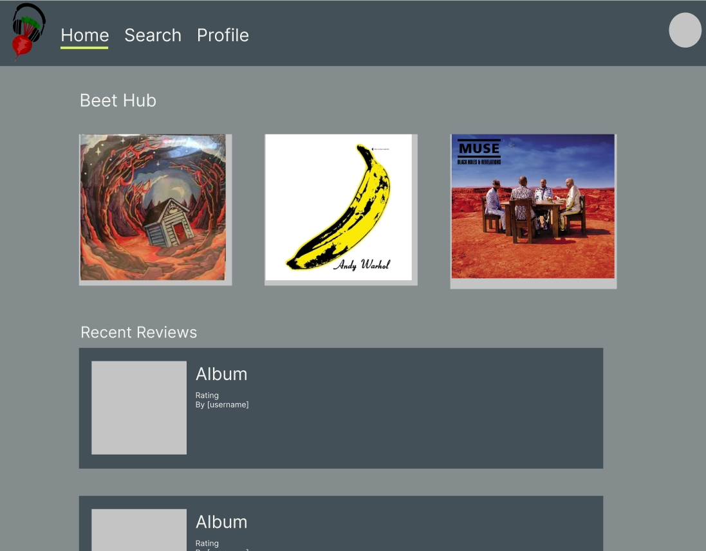

# beat-hub

An interactive music-sharing experience.

## Description

### Preview

This application is deployed at https://beathub.herokuapp.com/

Beathub is an interactive playlist-sharing experience. It is built for people who treat music as a lifestyle. Save your playlists, rate others choices, and share your insight. Beathub is integrated with your Spotify account, so there's no need to keep track of another subscription!

The app is built on MongoDB and the entire front end is built with react. The app is responsive and mobile-friendly, so you always have access.

## Table of contents

- [Installation](#installation)
- [Usage](#usage)
- [Maintainers](#maintainers)
- [Contributing](#contributing)
- [Tests](#tests)
- [Credits](#credits)
- [License](#license)

## Installation

Note: This is only necessary if you intend on deploying the app yourself. Otherwise, enjoy the deployment on Heroku, no install required.

It is important that you have both node.js and MongoDB installed before attempting to install the rest of the application's dependencies and running it.

Clone the repo from GitHub first.

Begin by running `npm install` in your terminal. Once this is finished, the app should be ready to start.

## Usage

Run `npm run develop` in your terminal and wait for the app to display in your default browser. For troubleshooting, it is sometimes best to `cd` into either server or client directories and run `npm watch` or `npm start` respectively.

## Maintainers

[@Daniel Harned](https://github.com/DrDano)

Email: [danielharned@gmail.com](mailto:danielharned@gmail.com)

## Contributing

Fork the project if you would like to contribute.

## Credits

- [MongoDB](https://www.mongodb.com/)
- [GraphQL](https://graphql.org/)
- [Apollo GraphQL](https://www.apollographql.com/docs/)
- [React](https://reactjs.org/)

## License

Licensed under [MIT](https://choosealicense.com/licenses/mit) 2022

